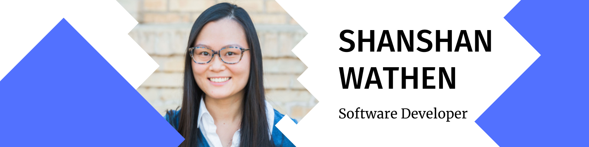

<h1 align="center">✨Howdy 👋, I'm Shanshan Su✨</h1>
<h3 align="center">A creative full stack developer from China</h3>

- 🔭 I’m currently working on [my portofolio](https://github.com/shanshan-su/shanshan-su.github.io)

- 🌱 I’m currently learning **Java junit test.**

- 📫 How to reach me **shanshansu36@gmail.com**

- ⚡ Fun fact **I can do arts, like drawing, watercolor painting. I like fitnesses, used to go to the gym 5 times a week before the pandemic.**

<h3 align="left">Connect with me:</h3>

<h3 align="left">Languages and Tools:</h3>

 
 
 
 
 

 
 

&nbsp;

